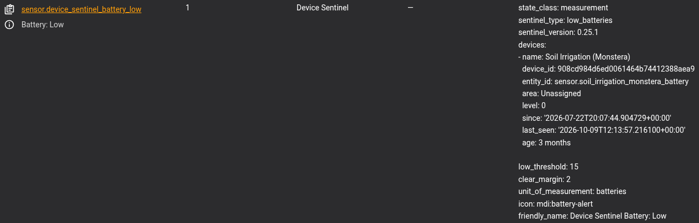
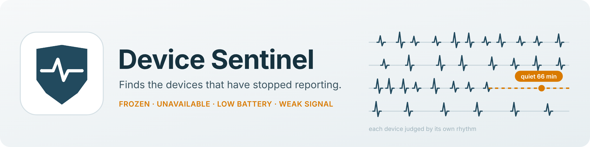
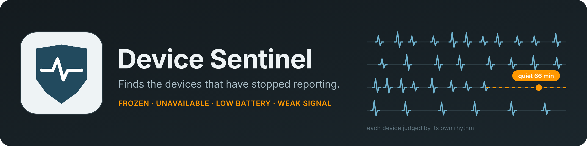

# Device Sentinel Images

The screenshots used in the [README](../../README.md) and the [wiki](https://github.com/TheThinkingHome/device_sentinel/wiki/Screenshots), with what each one shows. They are from a real house running Device Sentinel.

To use one from the wiki, link to its raw address: `https://raw.githubusercontent.com/TheThinkingHome/device_sentinel/main/docs/images/<file name>`, with each space written as `%20`.

## Setting Up

### Device Page Full.png

Device Sentinel's own page in Home Assistant, under Settings > Devices and Services. The controls are the Maintenance Mode button, the three Enable buttons and Regenerate Reports. The sensors beneath them count what is wrong, and the diagnostic sensors count what is watched, learned and set aside.

### Integration Settings Main.png

The configuration menu. Each entry opens one screen: Notifications and Daily Brief, Exclusions and Muting, Low Battery, Signal Strength, Freeze Detection, WiFi, Advanced and Extended Diagnostics.

### Integration Settings Exclusions and Muting.png

The Exclusions and Muting screen. Excluded integrations are set aside entirely. Muted integrations, labels and devices are still watched, but never reported.

## The Dashboard

### Dashboard Daily Brief.png

The Daily Brief tab: one calendar day at a time, with the Now table, Repeat Offenders and the Last 24 Hours timeline. The status row across the top shows each bridge, the broker, the Wi-Fi network and Maintenance Mode.

### Dashboard Battery Trends.png

The Battery Trends tab: every battery by maker and model, then the low cells, the falling cells with their weekly averages and time left, and the steady ones. Click a type to see only that type.

### Dashboard Signal Trends.png

The Signal Trends tab: devices that keep dropping out, days when several devices had a bad day together, one bar per device against its own normal, and the unsteady and steady lists.

### Dashboard Classification.png

The Classification tab: every device Device Sentinel found, whether it is watched, what mutes it, and why a set-aside device was set aside. A device another integration also lists reads "clone".

### Dashboard Integrations.png

The Integrations tab: one row per integration with its standing, how many of its devices are watched, muted or set aside, its open problems and its outages over fourteen days. The key under the table says what each standing means.

### Dashboard Integration Detail.png

An integration's own page: its devices with problems first, its outages over the last fourteen days, its bursts of updates, and any recommendation that names it.

### Dashboard Devices.png

The Devices tab: every watched device with its type, integration, standing, problem, last report, rhythm and freeze window. Click a type to narrow the list, or filter to the devices with a problem or the muted ones.

### Dashboard Recommendations.png

The Recommendations tab: the changes you could make, the most important first. Each card says what it found and why it matters.

### Dashboard Recommendations Open.png

A recommendation card opened. Power Not Set lets you choose each device's battery or power source right in the list; No Area Assigned links each device to its page.

## A Device's Page

### Dashboard Device Detail.png

A device's page: its status bar, with how long since its last report against its rhythm and its window, then its identity, power, signal and last-seen readings, its two freeze rules, its graphs and its silences.

### Dashboard Device Detail Trouble Frozen.png

The top of a frozen device's page. The status bar leads with the problem: how long the device has been silent and how far past its window it is.

### Dashboard Device Detail Identity.png

The Identity section: name, type, device ID, area, labels, maker, model, integration, how it connects, and its address, followed by the Power, Signal and Last seen groups, the wait rule and the mute buttons. A pencil marks what you can change.

### Dashboard Device Detail Type Picker.png

The Type picker. Choose the device's type from the list, or put it in your own words; the answer covers every device of the same model.

### Dashboard Device Detail Area Picker.png

The label picker open on a device page. Add an existing label, or type a new one and press Create and add. A mute by label takes effect without opening the settings.

### Dashboard Device Detail Power Pencil Open.png

The power pencil open. Pick a common battery and how many, or Mains Powered, USB Powered, USB Direct to Server or PoE Powered, or use the Battery Notes library's answer.

### Dashboard Device Detail Clone Hardware.png

The Same hardware row on a Bluetooth proxy's page. Two other integrations list the same hardware; each is named with its integration and why it is not watched.

### Dashboard Device Detail Rhythm.png

The two freeze rules side by side: the 14-Day Trimmed Maximum and the 42-Day Log-Normal Percentile, each with the days it set aside and its result as a red line. The one in use is tagged.

### Dashboard Device Detail Rhythm Chart.png

The rhythm graph: each day's longest gap, both rules' waits as dashed lines, the day that set the trimmed wait, days set aside, and a red dot where a gap ran past its window. Outages on the device's path are shaded behind it.

### Dashboard Device Detail Battery Chart.png

The battery graph: the level over three months, with the last four weeks' averages, the reading and the time left above it. A steady battery gets no forecast.

### Dashboard Device Detail Signal Chart.png

The signal graph: each day's median and low end against the device's own normal and its bad-day line. A bad day is marked with a red dot.

## Sensors

### sensor.device_sentinel_bridge & _broker.png

The Bridge: Zigbee2MQTT and Broker: MQTT sensors with their attributes: the bridge's permit-join state and availability setting, and the broker's start time, uptime, cadence and threshold.

### sensor.device_sentinel_battery_low.png

The Battery: Low sensor. Its attributes name each low battery, its level, its area, how long it has been low, and the threshold and clear margin in use.

## Repairs

### Repair Card Damaged Data File.png

A Repair card after Device Sentinel repaired a damaged data file. It says what was repaired and where the original is. Nothing is asked of you; Submit records that you read it.

### Repair Card Disabled Entities.png

The Repair card that offers to turn on the entities Device Sentinel reads: battery, last seen and signal. Enable turns them all on at once; Ignore hides the card.

## The Brief and Your Automations

### Device Sentinel Daily Brief Hard Copy.png

The daily brief as it arrives by email: In Short, Now, Repeat Offenders, Recommendations and Last 24 Hours, in the same layout as the dashboard's Daily Brief tab.

### Event Automation Example.png

An automation built on Device Sentinel's events. When a presence sensor is reported frozen or unavailable, it power-cycles the sensor's plug and waits for device_sentinel_recovered; if the sensor doesn't come back in fifteen minutes, it raises a notification. A second trigger turns the plug back on if it has been off for a minute.

## Banners

### device-sentinel-banner-light.png

The Device Sentinel banner, light version.

### device-sentinel-banner-dark.png

The Device Sentinel banner, dark version.

